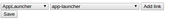
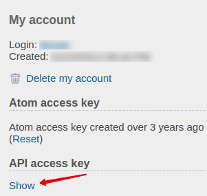
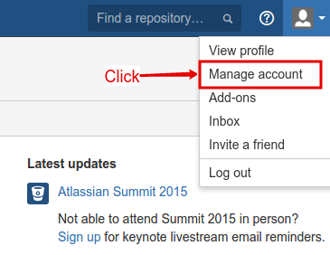
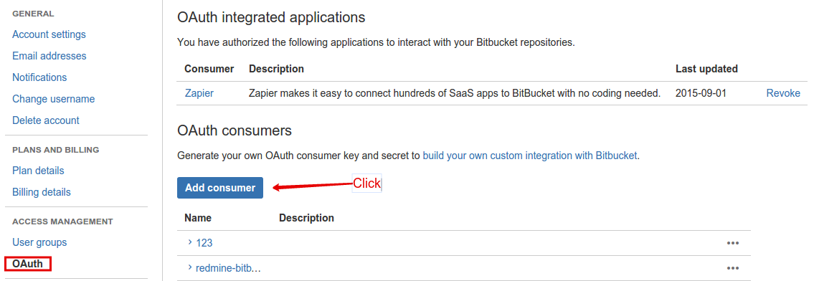
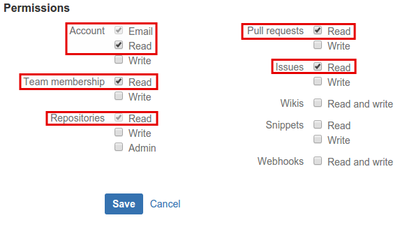
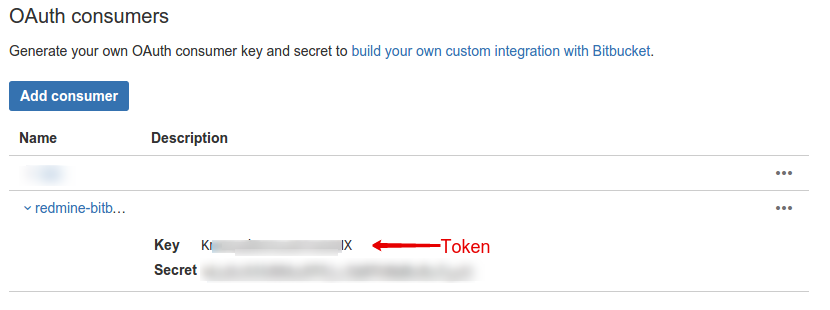

# bitbucket-redmine-sync

# Установка

* склонируйте репозиторий
* в хроме выберете установку распакованного расширения, указав путь до репозиторя

# Настройка

* перейдите в настройки, и задайте соответствие redmine-bitbucket с помощью выпадающих списков.  

* получение redmine-токена  

* получение bitbucket-токена
* 
* 
* 
* 
